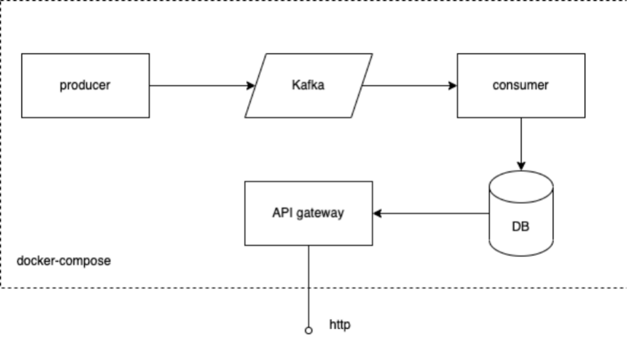

# Alt-Kraft-test-task

## Тестовое задание

---

Необходимо реализовать архитектуру, изображенную на рисунке. Система состоит из трех сервисов, написанных на python, очереди сообщений kafka и базы данных.

**Producer** - сервис, генерирующий события - сообщения в Kafka. Формат сообщения, способ сериализации можете выбрать на свое усмотрение. Выбор объясните.

**Consumer** - сервис, читающий сообщения из Kafka и сохраняющий их в базу. Количество топиков, партиций в Kafka и другие параметры выберете на свое усмотрение.

Базу данных также выберете на свое усмотрение. Выбор объясните.

API gateway - REST-api сервис для доступа к БД. Используйте стандарт OpenAPI 3 вместе со Swagger UI.

> Каждый сервис должен запускаться в Docker-контейнере, оркестрируйте запуск при помощи docker-compose.

Если на ваше усмотрение в системе необходимы другие сервисы или компоненты, можно их добавить. Свое решение объясните.

## Решение

---

Было решено смоделировать поток комментариев некоторой социальной сети.

Формат сообщения:

> Comment:
>
> - name
> - text
> - address

Комментарии генерируются producer в формате json и отправляются в топик comments. Мок данные создаются с помощью библиотеки Faker.

> Формат сообщения и способ сериализации были выбраны исходя из того что json сейчас является самым популярным форматом в веб разработке и очень активно используется при создании приложений.

В брокере создан топик comments который имеет 3 патриции.

Запускается 3 реплики consumer которые автоматически распределяются по партициям и читают из них. После прочтения данные отправляются в MongoDB.

> MongoDB в качестве бд была выбрана по следующим причинам:
>
> - Нет требований к поддержке acid транзакций
> - Простота и скорость разработки
> - Единственный сервис, который работает с бд => нет большой необходимости в фиксации схемы данных
> - Можно без особых усилий сохранять сообщения в формате json без дополнительной обработки

В качестве API gateway работает сервис на FastApi. В этом фреймворке есть встроенная поддержка генерации OpenApi и поддерживается Swagger.

- Swagger: `http://localhost:8000/api/openapi`
- OpenApi: `http://localhost:8000/api/openapi.json`

> FastApi в качестве веб фреймворка был выбран по следующим причинам:
>
> - Основными операциями являются memory bound перекачка данных из MongoDB => лучше выбрать асинхронный фреймворк
> - Поддержка OpenApi и Swagger из коробки
> - Скорость написания кода
> - Активная поддержка сообществом

Сервис имеет 2 ручки для чтения комментариев из бд, которые поддерживают пагинацию и чтение со смещением (ещё есть одна ручка - healthcheck)

На все компоненты написаны тесты. В репозитории подключен pre-commit.

## Запуск системы

`docker compose up`

## Запуск тестов

> Для запуска тестов понадобится [poetry](https://python-poetry.org/docs/)

### Producer

- `cd producer`
- `poetry install`
- `python -m pytest`

### Consumer

- `cd consumer`
- `poetry install`
- `python -m pytest`

### Service

- `cd service`
- `poetry install`
- `python -m pytest`
